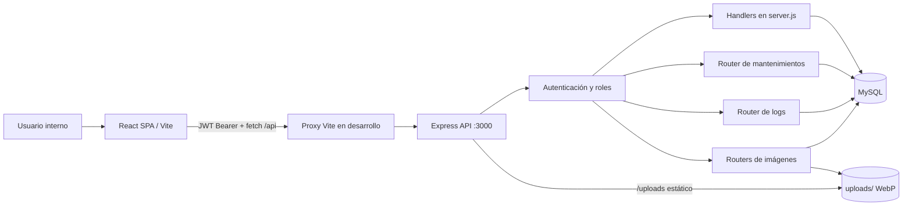

# SCAET — Sistema de Control y Administración de Equipos Tecnológicos
 
SCAET es una aplicación web interna para administrar el inventario de activos tecnológicos, sus proveedores, las personas a quienes se asignan, los resguardos con firma, devoluciones, mantenimientos y trazabilidad de actividad. El repositorio contiene dos aplicaciones que se ejecutan por separado: un frontend SPA en React y una API REST en Express conectada a MySQL.
 
> Alcance de este documento: refleja el código actualmente versionado. No hay migraciones, archivo SQL, contrato OpenAPI ni pruebas automatizadas en el repositorio; por tanto, los modelos relacionales se documentan a partir de las consultas e inserciones del backend, no como un esquema DDL definitivo.
 
## 1. Descripción general
 
El sistema resuelve el control operativo del ciclo de vida de equipos tecnológicos: alta y consulta de inventario, asociación con proveedores, asignación a colaboradores, generación/visualización de resguardos, recepción de devoluciones, registro de mantenimiento y auditoría de varias operaciones.
 
Su objetivo es conservar consistencia entre el estado de un equipo (`disponible`, `asignado`, `mantenimiento` o `baja`) y los movimientos que lo originan. Está dirigido al área de Sistemas/IT y a usuarios internos con roles de administración, captura o consulta.
 
## 2. Tecnologías
 
| Área | Tecnologías y uso |
| --- | --- |
| Lenguaje | JavaScript; JSX para la interfaz. |
| Frontend | React 19, React DOM, React Router DOM 7 y Vite 8. |
| Estilos | Tailwind CSS 4, PostCSS, Autoprefixer y CSS propio en `src/index.css` / `src/App.css`. |
| UI | `lucide-react` para iconos; `react-qr-code` para renderizar QR; `html5-qrcode` para leerlos con cámara. |
| Backend | Node.js, Express 5, CommonJS, CORS, `dotenv`. |
| Persistencia | MySQL mediante `mysql2/promise` y un pool de conexiones. |
| Seguridad | JWT (`jsonwebtoken`) y hashing de contraseñas con `bcryptjs`. `bcrypt` también está declarado, pero el servidor importa `bcryptjs`. |
| Archivos | Multer recibe imágenes en memoria; Sharp rota, reduce y convierte a WebP. |
| Servicios externos | Google Fonts carga Archivo Black y Roboto desde `index.html`. |
 
Dependencias declaradas sin uso encontrado en el código de aplicación: `browser-image-compression`, `fs-extra` (frontend y backend), `qrcode.react`, `@tailwindcss/postcss` y `autoprefixer` (la configuración PostCSS está vacía). Esto no prueba que no se requieran en un flujo externo, pero no participan en los archivos fuente actuales.
 
## 3. Arquitectura
 
El frontend es una SPA que consume rutas relativas `/api/*`. En desarrollo, Vite las redirige a `http://localhost:3000`; el backend no sirve el build del frontend. Express centraliza la mayor parte de rutas en `backend/server.js` y delega mantenimiento, logs e imágenes en routers independientes. La lógica de datos está acoplada a consultas SQL directamente en handlers/routers: no existen capas separadas de controladores, servicios o repositorios.
 

 
La UI se organiza por vistas de dos grupos históricos: `Views-Rubi` concentra inventario, proveedores, colaboradores, login y configuración; `Views-Nat` concentra asignaciones, resguardos, devoluciones, mantenimiento, reportes y auditoría. `App.jsx` coordina el subflujo de asignaciones con estado local temporal y rutas de React Router.
 
## 4. Estructura de carpetas
 
| Ruta | Responsabilidad |
| --- | --- |
| `src/` | Código de la SPA React. `main.jsx` monta la aplicación y `App.jsx` define las rutas. |
| `src/Views-Rubi/` | Pantallas CRUD de proveedores, colaboradores y equipos; dashboard, login, registro heredado y configuración de usuarios. |
| `src/Views-Nat/` | Flujo de asignación/resguardo/devolución, mantenimiento, reportes, logs y utilidades de fechas/moneda. |
| `src/components/` | Componentes transversales: botón de volver, firma preconfigurada e iconos SVG. |
| `src/features/notifications/` | Centro de notificaciones y servicio que deriva alertas de mantenimientos y asignaciones temporales. |
| `src/config/` | Firma institucional de entrega. |
| `src/utils/` | Lectura y actualización del perfil de sesión guardado en `localStorage`. |
| `src/assets/` | Logos, ilustración y firma usados por la interfaz. |
| `public/` | Favicons e iconos estáticos. |
| `backend/` | API Express independiente, con su propio `package.json` y `.env`. |
| `backend/config/db.js` | Crea y exporta el pool MySQL (`connectionLimit: 10`). |
| `backend/routes/` | Routers de mantenimientos, logs e imágenes de equipos/colaboradores. |
| `backend/utils/` | Utilidad para registrar actividad y eliminar campos sensibles de sus detalles. |
| `uploads/` | Almacenamiento local de imágenes WebP. El backend expone `/uploads` de forma estática y rutas públicas de lectura de imagen. |
| Raíz | Configuración Vite/Tailwind/ESLint, HTML de entrada y paquete del frontend. |
 
No se documentan `node_modules`, `dist` ni los binarios de imagen como código fuente. `.gitignore` excluye dependencias, builds y archivos `.env`.
 
## 5. Flujo general del sistema
 
1. El usuario abre la SPA y se autentica en `/login` con correo o nombre de usuario y contraseña.
2. `POST /api/login` valida la contraseña, registra un evento de sesión y devuelve un JWT de ocho horas junto con el perfil.
3. El frontend guarda el token en `localStorage` como `scaet-token` y el usuario como `scaet-user`; las solicitudes posteriores envían `Authorization: Bearer <token>`.
4. Express verifica la firma del token, vuelve a consultar el usuario en MySQL y bloquea cuentas inactivas. Las rutas mutables aplican además autorización por rol.
5. Los módulos consultan o modifican MySQL. Las operaciones críticas de asignación, devolución y mantenimiento usan transacciones y bloqueos `FOR UPDATE` para mantener la coherencia del inventario.
6. Cuando aplica, la API escribe un evento en `logs_actividad`. El frontend actualiza su estado y presenta la respuesta.
 
Flujo de datos resumido:
 
`Formulario/acción → validación en frontend → fetch con JWT → middleware → handler SQL/transacción → MySQL y/o uploads → JSON → estado React`.
 
## 6. Funcionalidades y módulos
 
| Módulo | Funcionalidad encontrada |
| --- | --- |
| Autenticación | Inicio de sesión con correo o usuario; cierre de sesión; cambio de contraseña propia; obligación de cambio tras crear/restablecer contraseña. |
| Usuarios/configuración | Administradores crean, editan, activan/ocultan usuarios, cambian roles y restablecen contraseñas. Capturistas pueden listar usuarios y restablecer contraseñas, excepto las de administradores. |
| Dashboard | Conteo de equipos por estado, últimos equipos y aviso de temporales próximos a vencer. Cachea últimos equipos por sesión del navegador. |
| Proveedores | Alta, edición, listado de activos/ocultos/todos y ocultamiento/restauración lógica. |
| Colaboradores | Alta, edición, búsqueda paginada, listado, conteo de equipos activos, fotos y ocultamiento/restauración lógica. |
| Equipos | Alta/edición, proveedor, garantía, estado, QR con token UUID, ficha técnica, búsqueda mediante cámara y fotos. El código se autogenera como `EQ-####` cuando no se proporciona. |
| Asignaciones | Selección de colaborador y equipos disponibles; asignación temporal o permanente; captura de accesorios, estado físico, fecha de devolución y observaciones; agrupa asignaciones activas por colaborador en la UI. |
| Resguardos | Crea un registro de resguardo por asignación, folio `RES-######`, vistas de documento y captura de firmas en la interfaz. Puede guardar firmas en el backend. No hay generación de PDF ni correo implementados aunque existen campos para ello. |
| Devoluciones | Devolución parcial o total de detalles de una asignación; crea resguardo `DEV-...`, registra firma/estado físico/accesorios/observaciones y devuelve equipos a disponibilidad. |
| Mantenimiento | Lista equipos pertinentes, historial por equipo y por colaborador, alta y actualización de fallas/correctivos/preventivos, coste y transición de estado del equipo. |
| Notificaciones | Consulta cada 10 segundos equipos en mantenimiento y asignaciones temporales; marca leídas por usuario únicamente en `localStorage`. |
| Reportes | Consolida inventario, proveedores, mantenimientos y resguardos; filtra, muestra detalle y exporta una tabla HTML con extensión `.xls` en el navegador. |
| Auditoría | `LogsActividad` consume logs reales paginados del backend, exclusivo de administrador. `AuditoriaList` es otra vista estática de demostración y no consulta la API. |
 
## 7. Modelos de datos
 
Las tablas y relaciones siguientes se infieren del uso de MySQL:
 
| Entidad | Atributos principales observados | Relaciones y propósito |
| --- | --- | --- |
| `usuarios` | `id_usuario`, nombre, `nombre_usuario`, correo, `contrasena_hash`, `rol`, `activo`, `debe_cambiar_contrasena`, fechas. | Emite sesiones JWT; registra altas, entregas y actividad. Roles: `admin`, `capturista`, `usuario`. |
| `proveedores` | Identificador, nombre, empresa, vendedor, RFC, contacto, calificación, observaciones, `activo`, fechas. | Puede ser referenciado por muchos `equipos`. Calificaciones permitidas: excelente, bueno, regular, malo. |
| `equipos` | Identificador/proveedor, código, nombre, tipo, marca, modelo, serie, compra, garantía y vencimiento, especificaciones, foto, QR, estado, `activo`, fechas. | Participa en detalles de asignación y mantenimientos. Estados válidos: disponible, asignado, mantenimiento, baja. |
| `colaboradores` | Número, nombre, área, departamento, puesto, contacto, foto, estado, observaciones, `activo`, fechas. | Tiene muchas `asignaciones`; no se asigna a un colaborador inactivo. |
| `asignaciones` | Identificador, colaborador, usuario que entrega, fecha de resguardo, estado, observaciones. | Cabecera de uno o más `asignacion_detalles`; una asignación activa puede pasar a `devuelta` cuando no quedan detalles activos. |
| `asignacion_detalles` | Asignación, equipo, snapshots de datos del equipo, tipo, fechas, accesorios, estado físico/observaciones de entrega y devolución, `estado_detalle`. | Relación entre asignación y equipo. Conserva snapshots para que documentos/historial no dependan de cambios posteriores del equipo. Estados usados: activo/devuelto. |
| `resguardos` | Asignación, usuario responsable, tipo de documento, fecha, snapshots de firmantes, folio, firmas, campos de PDF/correo, estado. | Un resguardo de tipo `asignacion` se crea al asignar; se generan otros de tipo `devolucion`. |
| `mantenimientos` | Equipo, usuario registrador, colaborador de contexto, tipo, título, descripción, técnico/proveedor, coste, estado, estados anterior/posterior, fechas, snapshots y observaciones. | Mantiene el historial del equipo. Tipos: falla, correctivo, preventivo. Estados: en_proceso, resuelto, cancelado. |
| `logs_actividad` | Usuario/snapshots, acción, módulo, entidad, ID, descripción, método, ruta, IP, agente, JSON de detalles, fecha. | Bitácora de acciones. La utilidad elimina claves sensibles antes de serializar detalles. |
 
Relaciones principales: `proveedores 1—N equipos`; `colaboradores 1—N asignaciones`; `usuarios 1—N asignaciones/resguardos/mantenimientos/logs`; `asignaciones 1—N asignacion_detalles`; `equipos 1—N asignacion_detalles` y `equipos 1—N mantenimientos`; `asignaciones 1—N resguardos` según el código.
 
## 8. Variables y configuración
 
### Backend: `backend/.env`
 
El archivo existe localmente y está ignorado por Git. No hay `.env.example`; cree uno con las siguientes claves, sin publicar secretos:
 
| Variable | Uso |
| --- | --- |
| `DB_HOST` | Host de MySQL. |
| `DB_USER` | Usuario de MySQL. |
| `DB_PASSWORD` | Contraseña de MySQL. |
| `DB_NAME` | Base de datos MySQL. |
| `PORT` | Puerto de Express; si falta usa `3000`. |
| `JWT_SECRET` | Secreto para firmar y verificar JWT. Debe ser aleatorio y privado. |
| `ADMIN_EMAILS` | Está definido en el `.env` actual, pero no tiene referencias en el backend; no afecta el comportamiento actual. |
 
### Frontend
 
Vite proxy: `vite.config.js` envía `/api` a `http://localhost:3000` durante `npm run dev`. El host está habilitado para conexiones externas y `allowedHosts: true`.
 
Persistencia local relevante: `scaet-token`, `scaet-user`, `scaet-theme`, estado de lectura de notificaciones, y caché de dashboard en `sessionStorage`.
 
## 9. Instalación y ejecución
 
Requisitos deducibles: Node.js compatible con Vite 8/React 19, npm y un servidor MySQL con las tablas y columnas usadas por el backend. El repositorio no aporta DDL ni datos semilla; esa preparación debe obtenerse del entorno responsable de la base de datos.
 
```powershell
git clone <URL_DEL_REPOSITORIO>
Set-Location scaet-app
npm install
 
Set-Location backend
npm install
```
 
1. Cree `backend/.env` con las variables anteriores y configure una base MySQL compatible.
2. En una terminal, ejecute el backend:
 
```powershell
Set-Location backend
npm run dev
```
 
3. En otra terminal, inicie el frontend desde la raíz:
 
```powershell
npm run dev
```
 
4. Abra la URL que indique Vite. El frontend usará el proxy hacia el backend en el puerto 3000.
 
Para una compilación de frontend:
 
```powershell
npm run build
npm run preview
```
 
Para ejecutar el backend sin reinicio automático:
 
```powershell
Set-Location backend
npm start
```
 
El backend no publica `dist`; en producción hay que servir el resultado de Vite desde un servidor web/CDN o añadir explícitamente ese servicio, y enrutar `/api` hacia Express.
 
## 10. Scripts disponibles
 
### Raíz (frontend)
 
| Script | Efecto |
| --- | --- |
| `npm run dev` | Levanta Vite con HMR y el proxy `/api`. |
| `npm run build` | Genera el bundle optimizado en `dist/`. |
| `npm run lint` | Ejecuta ESLint sobre el proyecto con reglas JavaScript, hooks de React y React Refresh. |
| `npm run preview` | Sirve localmente el build ya generado para comprobarlo. |
 
### `backend/`
 
| Script | Efecto |
| --- | --- |
| `npm run dev` | Ejecuta `nodemon server.js`; reinicia el proceso al detectar cambios. |
| `npm start` | Ejecuta `node server.js` sin observación de cambios. |
 
No hay scripts de test, migración, seed, formateo ni despliegue.
 
## 11. Dependencias importantes
 
| Dependencia | Motivo de uso en código |
| --- | --- |
| `react`, `react-dom`, `react-router-dom` | SPA, renderizado y navegación. |
| `vite`, `@vitejs/plugin-react` | Servidor y empaquetado del frontend. |
| `tailwindcss`, `@tailwindcss/vite` | Utilidades de estilo y plugin de Vite. |
| `lucide-react` | Iconografía de la interfaz. |
| `html5-qrcode` | Descubrimiento de cámaras y lectura de QR en el listado de equipos. |
| `react-qr-code` | Renderizado del QR en fichas de equipo. |
| `express`, `cors`, `dotenv` | API HTTP, CORS sin restricción de origen y carga de variables. |
| `mysql2` | Pool y consultas parametrizadas a MySQL. |
| `jsonwebtoken`, `bcryptjs` | Token de sesión y verificación/hash de contraseñas. |
| `multer`, `sharp` | Validación, recepción y conversión de imágenes a WebP. |
| `nodemon` | Recarga del servidor en desarrollo. |
 
## 12. API REST
 
Todas las rutas `/api` salvo `POST /api/login`, `GET /api/test-db` y las lecturas de imágenes requieren `Authorization: Bearer <JWT>`. Las imágenes se suben como `multipart/form-data` con el campo `imagen`; se aceptan JPEG, PNG y WebP de hasta 5 MiB y se transforman a WebP de máximo 1920×1920.
 
| Área | Endpoints |
| --- | --- |
| Salud | `GET /`, `GET /api/test-db`. |
| Sesión | `POST /api/login`. |
| Usuarios | `POST/GET /api/usuarios`; `PUT /api/usuarios/me/perfil`; `PUT /api/usuarios/me/password`; `PUT /api/usuarios/correo`; `PUT /api/usuarios/:id_usuario`, `/:id_usuario/rol`, `/:id_usuario/password`, `/:id_usuario/estado`. |
| Proveedores | `GET/POST /api/proveedores`; `PUT /api/proveedores/:id_proveedor`; `PUT /api/proveedores/:id_proveedor/estado`. |
| Equipos | `GET/POST /api/equipos`; `GET/PUT /api/equipos/:id_equipo`; `PUT /api/equipos/:id_equipo/estado`; `GET /api/equipos/qr/:qr_token`. Filtros de listado: `estado`, `tipo_equipo`, `marca`, `id_proveedor`, `estado_equipo`. |
| Dashboard | `GET /api/dashboard/resumen`; `GET /api/dashboard/ultimos-equipos?limit=1..10`. |
| Colaboradores | `GET/POST /api/colaboradores`; `GET /api/colaboradores/buscar?q=&offset=&limit=`; `PUT /api/colaboradores/:id_colaborador`; `PUT /api/colaboradores/:id_colaborador/estado`. |
| Asignaciones | `GET /api/asignaciones/activas`; `POST /api/asignaciones`; `GET /api/asignaciones/:id_asignacion`; `POST /api/asignaciones/:id_asignacion/devoluciones`. |
| Resguardos | `GET /api/resguardos`; `GET /api/resguardos/:id_resguardo`; `PUT /api/resguardos/:id_resguardo/firmas`. |
| Mantenimiento | `GET /api/mantenimientos/equipos`; `GET/POST /api/mantenimientos`; `GET /api/mantenimientos/equipo/:id_equipo`; `PUT /api/mantenimientos/:id_mantenimiento`. |
| Auditoría real | `GET /api/logs-actividad/usuarios`; `GET /api/logs-actividad?fecha=&accion=&id_usuario=&limit=&offset=`. El límite se acota a 200. |
| Imágenes | `POST /api/equipos-imagenes/:id_equipo`, `GET /api/equipos-imagenes/:id_equipo`; equivalentes bajo `/api/colaboradores-imagenes/:id_colaborador`; `GET /uploads/*`. Las lecturas son públicas. |
 
## 13. Autenticación y autorización
 
El backend valida el login contra `usuarios`, compara `contrasena` con `contrasena_hash` mediante bcrypt y firma un JWT de ocho horas con `JWT_SECRET`. En cada solicitud protegida, `verificarToken` valida el Bearer token, vuelve a consultar la cuenta y rechaza usuarios inactivos.
 
| Rol | Permisos observados |
| --- | --- |
| `admin` | Administración completa; crear usuarios, editar roles, activar/ocultar entidades, logs y acciones operativas. |
| `capturista` | CRUD operativo de proveedores, colaboradores y equipos; asignaciones, devoluciones, mantenimiento, subida de imágenes; listar usuarios y restablecer contraseñas sin poder restablecer la de un administrador. |
| `usuario` | Rol válido en backend, pero no hay pantallas ni permisos especiales explícitos; puede acceder a endpoints que solo exigen token. |
 
La autorización real reside en la API. En el cliente, solo las rutas de logs y auditoría tienen el guard `AdminRoute`; las demás rutas de UI no tienen un guard general de autenticación. Las cookies no se usan: sesión, token y preferencias viven en `localStorage`.
 
## 14. Flujo interno crítico
 
### Asignar equipos
 
`NuevaAsignacion` busca colaboradores y pide equipos disponibles → `App.jsx` conserva la selección y crea el documento visual → `POST /api/asignaciones` valida colaborador, duplicados, tipo temporal/permanente y fecha → transacción bloquea colaborador/equipos/detalles → crea cabecera y detalles con snapshots → cambia cada equipo a `asignado` → crea resguardo `RES-*` → confirma y registra log.
 
### Devolver equipos
 
La vista recupera la asignación → el usuario selecciona detalles y firma/estado físico → `POST .../devoluciones` bloquea asignación y detalles activos → marca detalles como devueltos → cambia sus equipos a `disponible` → marca la asignación como `devuelta` solo si ya no quedan detalles activos → inserta un resguardo de devolución → confirma y registra log.
 
### Registrar mantenimiento
 
La bitácora obtiene el equipo e historial → el formulario valida tipo, estado, fecha y coste → `POST /api/mantenimientos` bloquea equipo y asignación actual → guarda snapshots y estado anterior/posterior → actualiza el estado del equipo dentro de la misma transacción. Al resolver, vuelve a `asignado` si mantiene una asignación activa o a `disponible` si no; al cancelar intenta restaurar el estado previo.
 
### Imágenes
 
El frontend valida tipo/tamaño y envía `imagen` → Multer guarda en memoria → Sharp normaliza orientación, comprime y escribe temporalmente → se renombra a `uploads/equipos/<código>.webp` o `uploads/colaboradores/<número>.webp` → se actualizan `foto_key` y `foto_url` → se elimina la imagen anterior de forma segura si corresponde.
 
## 15. Convenciones del proyecto
 
- La interfaz usa componentes funcionales, hooks y `fetch` nativo; no hay cliente HTTP, store global ni capa de servicios transversal para la API.
- Los campos y nombres de API/base de datos usan `snake_case`; las vistas transforman a modelos de UI cuando hace falta.
- Las respuestas de error usan normalmente `{ mensaje }`; las respuestas de listado usan un plural (`equipos`, `proveedores`, etc.).
- Las mutaciones validan entradas en backend, devuelven 400/401/403/404/409/500 y registran actividad de manera no bloqueante (`void registrarLogActividad`) en varios flujos.
- Las bajas son lógicas con `activo` en proveedores, colaboradores, equipos y usuarios; no hay endpoints DELETE.
- Las pantallas combinan Tailwind con valores visuales y texto en español directamente en JSX. El modo oscuro se controla con la clase `dark` sobre `document.documentElement` y se persiste como `scaet-theme`.
- Los archivos `asignacionData.js`, `mantenimientoData.js`, `equiposData.js` contienen datos/ayudas de prototipo o compatibilidad; los flujos activos principales consultan la API.
 
## 16. Puntos de entrada recomendados
 
1. `README.md` — mapa del sistema y restricciones conocidas.
2. `src/App.jsx` — todas las rutas, protecciones de UI y coordinación del flujo de asignación.
3. `backend/server.js` — middleware, autenticación y rutas principales de la API.
4. `backend/config/db.js` y `backend/.env` — conectividad y configuración de MySQL (sin exponer secretos).
5. `backend/routes/mantenimientos.routes.js` — ejemplo más completo de reglas de estado y transacciones.
6. `src/Views-Nat/AsignacionNueva.jsx`, `ResguardoFirma.jsx` y `DevolucionFirma.jsx` — ciclo de custodia.
7. `src/Views-Rubi/ListadoEquipos.jsx`, `EquipoAlta.jsx` y `EquipoFichaTecnica.jsx` — inventario y QR.
8. `src/Views-Rubi/Configuracion.jsx` y `backend/utils/logsActividad.js` — gestión de usuarios y trazabilidad.
 
## 17. AI Context
 
SCAET es una SPA React/Vite de administración de activos de IT con una API Express/MySQL independiente. No asumas una capa de servicios, ORM, migraciones, tests, ni que el backend sirva el frontend: la mayoría de reglas SQL están en `backend/server.js` y en `backend/routes/mantenimientos.routes.js`.
 
Los módulos de dominio activos son: usuarios/autenticación, proveedores, colaboradores, equipos/QR/imágenes, asignaciones, resguardos, devoluciones, mantenimiento, reportes, notificaciones y logs. La integridad más delicada está en `equipos.estado`, `asignaciones.estado` y `asignacion_detalles.estado_detalle`. Al ampliar asignaciones, devoluciones o mantenimiento, conserva las transacciones, bloqueos `FOR UPDATE`, snapshots históricos y actualización coordinada de estado. No implementes una modificación manual que deje un equipo asignado como disponible si sigue teniendo un detalle activo.
 
El token se guarda en `localStorage` y se transmite como Bearer. La API es la fuente de autorización; React solo protege visualmente logs/auditoría con `AdminRoute`. Agrega una ruta nueva de API en `backend/server.js` o en un router dedicado, aplica `verificarToken`/`autorizarRoles`, usa consultas parametrizadas y actualiza el frontend con el token. Para UI, registra la ruta en `src/App.jsx`, navegación en `Layout.jsx` si corresponde y reutiliza las convenciones de respuesta `{ mensaje }`.
 
Archivos críticos: `src/App.jsx`, `backend/server.js`, `backend/routes/mantenimientos.routes.js`, los routers de imágenes, `src/Views-Nat/{AsignacionNueva,ResguardoFirma,DevolucionFirma}.jsx` y `src/Views-Rubi/{ListadoEquipos,EquipoAlta,Configuracion}.jsx`. No trates `Register.jsx`, `AuditoriaList.jsx` ni los archivos de datos de prototipo como flujos de producción sin revisarlos: contienen conexiones/datos no alineados con la API vigente. No modifiques secretos del `.env`, binarios de `uploads/` o artefactos generados (`node_modules`, `dist`) para cambios de producto.
 
La persistencia efectiva es MySQL y el almacenamiento local de imágenes. Las notificaciones son calculadas en cliente y su estado de lectura no se comparte entre usuarios/dispositivos.
 
## 18. Problemas conocidos y deuda técnica detectada
 
- No hay esquema SQL, migraciones, seeds ni `.env.example`; no es posible levantar una base compatible únicamente a partir del repositorio sin reconstruirla desde consultas.
- No hay pruebas automatizadas ni scripts de prueba.
- `npm run lint` no pasa en el estado actual: ESLint aplica globals de navegador al backend CommonJS (`require`, `module`, `process` y `__dirname` quedan sin definir) y además detecta variables sin usar y actualizaciones síncronas de estado dentro de efectos en varias vistas. El build de Vite sí completa, con una advertencia de bundle JavaScript superior a 500 kB.
- `Register.jsx` intenta `POST http://localhost:3000/api/register`, pero el backend no define esa ruta y `App.jsx` redirige `/register` a `/login`; es código inaccesible/desalineado.
- `AuditoriaList.jsx` usa una lista fija y botones de exportación sin comportamiento. La auditoría real es `LogsActividad.jsx` contra `/api/logs-actividad`.
- CORS se habilita sin lista de orígenes y `GET /api/test-db` no requiere autenticación; además, ante error expone `error.message`. Son decisiones que conviene endurecer antes de una exposición pública.
- El frontend almacena el JWT en `localStorage`; el diseño actual no usa rotación, refresh token, cookies `HttpOnly` ni una protección general de rutas.
- Existen campos `pdf_key`, `pdf_url` y `correo_enviado` en consultas/inserciones de resguardos, pero el código no genera PDF ni envía correo.
- La lectura de fotos por API y `/uploads` es pública por diseño. Evalúe si las imágenes de colaboradores deben requerir autenticación.
 
## 19. Futuras mejoras
 
- Versionar DDL/migraciones, índices, restricciones e información de arranque de MySQL.
- Extraer rutas de `server.js` hacia controladores, servicios y repositorios, con validación de esquemas y pruebas unitarias/integración.
- Añadir un cliente HTTP común, guard de sesión global, manejo uniforme de 401 y control de permisos en la UI.
- Sustituir JWT en `localStorage` por una estrategia revisada de sesión, restringir CORS y proteger el endpoint de diagnóstico según el entorno.
- Implementar realmente PDF/correo de resguardos o eliminar/documentar los campos no usados.
- Unificar las dos pantallas de auditoría y retirar prototipos/datos/dependencias inactivos una vez confirmada su obsolescencia.
- Centralizar configuración por entorno, añadir `.env.example` seguro y preparar una estrategia de almacenamiento/backup para `uploads`.
- Automatizar lint, build y pruebas en CI.
 
## 20. Diagrama de arquitectura
 
El diagrama de la sección de arquitectura es la representación operativa vigente: React se comunica por `/api` con Express; Express usa MySQL y el sistema de archivos local para imágenes. No hay evidencia en el código de generación de PDF, servicio de correo ni API externa de negocio activa.