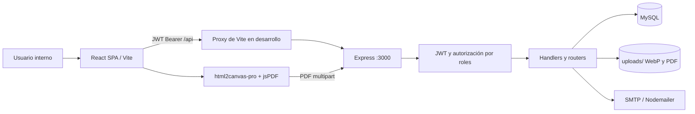

# SCAET — Sistema de Control y Administración de Equipos Tecnológicos

SCAET es una aplicación web interna para administrar el inventario de activos tecnológicos, proveedores, colaboradores, asignaciones, resguardos firmados, devoluciones, mantenimientos y la trazabilidad de las acciones. El repositorio contiene un frontend SPA en React/Vite y una API REST Express/MySQL que se ejecutan por separado.

> Esta documentación describe el código actualmente versionado. Existen dos migraciones SQL para funcionalidades recientes, pero no un DDL completo ni datos semilla de todas las tablas; el modelo restante se infiere de las consultas del backend.

## 1. Descripción general

El sistema controla el ciclo de vida de los equipos: se registran con proveedor, especificaciones, garantía, QR e imagen; se entregan a colaboradores mediante asignaciones temporales o permanentes; se generan resguardos y comprobantes de devolución con firmas, PDF y correo; y se registran mantenimientos y actividad administrativa.

Su objetivo es evitar inconsistencias entre inventario y custodia —por ejemplo, que un equipo siga disponible si posee una asignación activa— y mantener evidencia documental de los movimientos. Está dirigido a personal interno de Sistemas/IT con roles de administrador, capturista o usuario de consulta.

## 2. Tecnologías

| Área | Tecnologías y uso |
| --- | --- |
| Lenguajes | JavaScript, JSX, SQL y CSS. |
| Frontend | React 19, React DOM, React Router DOM 7 y Vite 8. |
| Estilos | Tailwind CSS 4, plugin `@tailwindcss/vite`, CSS global y Google Fonts (Archivo Black y Roboto). |
| UI | `lucide-react`, `react-qr-code` y `html5-qrcode` para iconos y QR. |
| Documentos | `html2canvas-pro` captura el documento renderizado y `jspdf` crea el PDF Letter vertical. |
| Backend | Node.js, Express 5, CORS, dotenv y CommonJS. |
| Base de datos | MySQL, accedido mediante `mysql2/promise` y pool de conexiones. |
| Seguridad | JWT (`jsonwebtoken`), contraseñas con `bcryptjs`, autorización por roles. |
| Archivos | Multer para `multipart/form-data`; Sharp valida, redimensiona y convierte imágenes a WebP. |
| Correo | Nodemailer para enviar resguardos/devoluciones PDF adjuntos mediante SMTP. |

`bcrypt`, `qrcode.react`, `fs-extra`, `@tailwindcss/postcss` y `autoprefixer` están declarados; no se localizaron usos de aplicación de los primeros cuatro (ni configuración PostCSS efectiva). `browser-image-compression`, en cambio, sí comprime fotos antes de subirlas desde equipos y colaboradores.

## 3. Arquitectura

El frontend es una SPA que hace `fetch` a `/api/*`. En desarrollo, Vite redirige esas solicitudes a `http://localhost:3000`. Express concentra las rutas principales en `backend/server.js` y monta routers especializados para mantenimiento, archivos, correo y configuración. No existe ORM, capa de servicios de dominio general, controladores separados ni repositorios: los handlers realizan validación y SQL parametrizado directamente.



La generación visual del PDF ocurre en el navegador. El backend recibe ese PDF, puede guardarlo en `uploads/resguardos/` y/o enviarlo al correo del colaborador con copia configurable. Las pantallas se dividen históricamente entre `Views-Rubi` (inventario/administración) y `Views-Nat` (custodia y documentos).

## 4. Estructura de carpetas

| Ruta | Responsabilidad |
| --- | --- |
| `src/` | SPA React. `main.jsx` monta la aplicación; `App.jsx` define las rutas y orquesta el flujo de asignación. |
| `src/Views-Rubi/` | Login, dashboard, proveedores, colaboradores, equipos, ficha QR, configuración de cuenta y configuración institucional. |
| `src/Views-Nat/` | Asignaciones, resguardos, devoluciones, mantenimiento, reportes, logs, auditoría estática y utilidades de fecha/moneda. |
| `src/components/` | Componentes reutilizables: volver, iconos SVG y firma que acepta la configuración institucional. |
| `src/features/notifications/` | Centro de alertas y servicio que calcula alertas de mantenimiento/asignaciones temporales. |
| `src/utils/` | Perfil de usuario almacenado y generación/descarga de PDF de resguardos. |
| `src/config/` | Firma estática de respaldo para documentos. |
| `src/assets/`, `public/` | Imágenes, logotipos y recursos estáticos. |
| `backend/` | API Express con dependencias y `.env` propios. |
| `backend/config/` | Pool MySQL. |
| `backend/routes/` | Routers de mantenimiento, logs, imágenes, configuración institucional y PDF/correo de resguardos. |
| `backend/services/` | Servicio SMTP y composición de mensajes de resguardo/devolución. |
| `backend/utils/` | Registro de actividad con saneamiento de campos sensibles. |
| `backend/migrations/` | Migraciones para `configuracion_sistema` y `resguardo_detalles`. |
| `uploads/` | Almacenamiento local de imágenes WebP, firma institucional y PDFs. Express expone `/uploads` estáticamente. |

Se excluyen del análisis `node_modules`, `dist` y artefactos generados. `.gitignore` evita versionar variables de entorno, dependencias y compilados.

## 5. Flujo general del sistema

1. El usuario entra a `/login`, envía identificador y contraseña a la API y recibe un JWT válido ocho horas.
2. React guarda `scaet-token` y `scaet-user` en `localStorage`; cada petición protegida envía `Authorization: Bearer <token>`.
3. `verificarToken` comprueba el JWT y vuelve a consultar el usuario en MySQL; `autorizarRoles` limita las operaciones mutables.
4. La API valida la petición y consulta o modifica MySQL. Asignación, devolución y mantenimiento usan transacciones y bloqueos `FOR UPDATE`.
5. Si la operación crea un documento, React genera un PDF desde el DOM. Este puede descargarse, guardarse en el servidor y enviarse por SMTP.
6. Las operaciones relevantes crean registros en `logs_actividad`; el frontend actualiza su estado o presenta el error recibido.

Recorrido genérico: `Formulario → validación de UI → fetch con Bearer → middleware JWT/rol → handler SQL/transacción → MySQL/archivos/SMTP → JSON → estado React`.

## 6. Funcionalidades

| Módulo | Capacidades implementadas |
| --- | --- |
| Sesión y usuarios | Login por correo o usuario, cierre de sesión, cambio de contraseña, alta/edición de usuarios, activación lógica, roles y restablecimiento de contraseña. |
| Dashboard | Resumen por estado, últimos equipos y temporales próximos a vencer; cache de últimos equipos por sesión. |
| Proveedores | Alta, edición, listados activos/ocultos/todos y restauración/ocultamiento lógico. |
| Colaboradores | CRUD, búsqueda paginada, contador de equipos activos, fotos comprimidas y cambio de visibilidad. |
| Equipos | Alta/edición, garantía, proveedor, estados, imagen, QR UUID, escáner de cámara, descarga y guardado del PNG de QR. |
| Asignaciones | Entrega de uno o varios equipos disponibles a un colaborador, temporal o permanente, con accesorios, estado físico y observaciones. El rol `usuario` ve el módulo en modo solo lectura. |
| Resguardos | Folio de asignación `RES-######`, documentos por tipo de activo, firmas, descarga/generación de PDF, guardado local y envío/reenvío por correo. |
| Devoluciones | Parciales o totales, con folio `DEV-...`, relación explícita de los detalles devueltos, PDF y correo. |
| Mantenimiento | Fallas, correctivos y preventivos; bitácora por equipo y colaborador; coste y transición coordinada de estado. |
| Configuración de sistema | Solo administración: nombre de empresa, responsable, puesto, firma WebP y correo CC de los documentos. Incluye restauración de valores predeterminados. |
| Notificaciones | Consulta cada 10 segundos mantenimientos y temporales; las lecturas se almacenan solo en el navegador. |
| Reportes | Consolida inventario, proveedores, mantenimientos y resguardos; filtra, muestra detalles y exporta tabla HTML como `.xls`. |
| Auditoría | `LogsActividad` consume la bitácora real paginada; `AuditoriaList` es una vista estática independiente. |

## 7. Modelos de datos

| Entidad | Datos principales observados | Relaciones/función |
| --- | --- | --- |
| `usuarios` | ID, nombre, usuario, correo, hash, rol, activo, cambio de contraseña, fechas. | Autentica, entrega equipos, administra y genera logs. Roles válidos: `admin`, `capturista`, `usuario`. |
| `proveedores` | Nombre, empresa, vendedor, RFC, contacto, calificación, observaciones, activo. | Un proveedor puede relacionarse con muchos equipos. |
| `equipos` | Proveedor, código, tipo, marca/modelo/serie, compra/garantía, especificaciones, foto, QR, estado, activo. | Se usa en detalles de asignación y mantenimiento. Estados: disponible, asignado, mantenimiento, baja. |
| `colaboradores` | Número, nombre, área, departamento, puesto, contacto, foto, estado, activo. | Tiene asignaciones y recibe los documentos de custodia. |
| `asignaciones` | Colaborador, usuario de entrega, fecha, estado, observaciones. | Cabecera de una o varias líneas; estado activa o devuelta. |
| `asignacion_detalles` | Asignación/equipo, snapshots, tipo, fechas, accesorios, estado/observaciones de entrega y devolución. | Custodia individual del equipo; `activo` o `devuelto`. Los snapshots preservan historia. |
| `resguardos` | Asignación, responsable, tipo, folio, snapshots de firmantes, firmas, datos de PDF/correo, estado. | Documentos de asignación y devolución. |
| `resguardo_detalles` | ID, `id_resguardo`, `id_detalle`. | Tabla introducida por migración: relaciona exactamente una devolución con sus detalles devueltos; par único por resguardo/detalle. |
| `mantenimientos` | Equipo, autor, contexto, tipo, título, proveedor/técnico, coste, estados, fechas, snapshots. | Historial técnico del equipo. Tipos: falla, correctivo, preventivo. |
| `configuracion_sistema` | Registro único `id_configuracion=1`, empresa, responsable, puesto, firma, CC y fechas. | Fuente institucional para documentos y correo CC. |
| `logs_actividad` | Usuario y snapshots, acción, módulo, entidad, ruta/IP/agente, detalles JSON y fecha. | Evidencia de operaciones; se eliminan claves sensibles antes de guardar detalles. |

Relaciones clave: `proveedores 1—N equipos`; `colaboradores 1—N asignaciones`; `asignaciones 1—N asignacion_detalles`; `equipos 1—N asignacion_detalles/mantenimientos`; `asignaciones 1—N resguardos`; `resguardos 1—N resguardo_detalles`.

## 8. Variables y configuración

### `backend/.env`

El archivo está ignorado. No incluya secretos en Git.

| Variable | Uso |
| --- | --- |
| `DB_HOST`, `DB_USER`, `DB_PASSWORD`, `DB_NAME` | Conexión MySQL. |
| `PORT` | Puerto Express; por defecto `3000`. |
| `JWT_SECRET` | Secreto de firma/verificación del JWT. |
| `ADMIN_EMAILS` | Está definido, pero no se referencia en el código backend actual. |
| `MAIL_HOST`, `MAIL_PORT`, `MAIL_SECURE` | Host, puerto y uso TLS directo del transporte SMTP. |
| `MAIL_USER`, `MAIL_PASSWORD` | Credenciales SMTP y dirección usada como remitente. |
| `MAIL_FROM_NAME` | Nombre visible del remitente; es obligatorio para habilitar el transporte. |
| `MAIL_CC` | CC de respaldo cuando `configuracion_sistema.correo_cc` está vacío o no es válido. |

El transporte SMTP se crea al cargar el proceso. Si faltan host, puerto válido, usuario, contraseña o nombre remitente, los envíos responden 503; `verificarTransporterCorreo()` intenta verificarlo al arrancar.

### Frontend

`vite.config.js` reenvía `/api` a `http://localhost:3000` en desarrollo.

Claves locales: `scaet-token`, `scaet-user`, `scaet-theme`, estado de lectura de notificaciones y caché de dashboard en `sessionStorage`.

## 9. Instalación

Requiere Node.js compatible con Vite 8/React 19, npm, MySQL y —para correo— acceso SMTP. Las migraciones disponibles deben aplicarse sobre una base que ya contenga el esquema histórico de SCAET; no hay migración inicial completa.

```powershell
git clone <URL_DEL_REPOSITORIO>
Set-Location scaet-app
npm install

Set-Location backend
npm install
```

1. Cree `backend/.env` con las variables de base de datos, JWT y SMTP necesarias.
2. Aplique, en este orden cuando corresponda, las migraciones de `backend/migrations/`.
3. Levante la API:

```powershell
Set-Location backend
npm run dev
```

4. En otra terminal, desde la raíz, inicie Vite:

```powershell
npm run dev
```

Para producción del frontend:

```powershell
npm run build
npm run preview
```

El backend no sirve `dist/`; en despliegue se debe servir el build desde un servidor web/CDN y enrutar `/api` hacia Express. Para Express sin observación: `backend/npm start`.

## 10. Scripts disponibles

| Ubicación | Script | Qué hace |
| --- | --- | --- |
| Raíz | `npm run dev` | Inicia Vite con HMR y proxy API. |
| Raíz | `npm run build` | Compila el frontend a `dist/`. |
| Raíz | `npm run lint` | Ejecuta ESLint sobre el repositorio. |
| Raíz | `npm run preview` | Sirve localmente el bundle ya compilado. |
| `backend/` | `npm run dev` | Arranca `nodemon server.js`. |
| `backend/` | `npm start` | Arranca `node server.js` sin reinicio automático. |

No existen scripts de test, migración, seed, formateo, generación de tipos ni despliegue.

## 11. Dependencias importantes

| Dependencia | Uso |
| --- | --- |
| `react`, `react-dom`, `react-router-dom` | SPA, renderizado y navegación. |
| `vite`, `@vitejs/plugin-react` | Desarrollo y empaquetado. |
| `tailwindcss`, `@tailwindcss/vite` | Estilos utilitarios. |
| `html5-qrcode`, `react-qr-code` | Lectura de cámara y representación QR. |
| `browser-image-compression` | Reduce fotos antes de subirlas. |
| `html2canvas-pro`, `jspdf` | PDF de documentos en cliente. |
| `express`, `cors`, `dotenv` | API HTTP y configuración. |
| `mysql2` | Pool y SQL parametrizado. |
| `jsonwebtoken`, `bcryptjs` | Autenticación y credenciales. |
| `multer`, `sharp` | Carga y normalización de imágenes/adjuntos. |
| `nodemailer` | Transporte SMTP de PDFs. |
| `nodemon` | Recarga del backend en desarrollo. |

## 12. API

Salvo `POST /api/login`, `GET /api/test-db` y lecturas de imagen, las rutas requieren JWT Bearer. Las mutaciones de inventario/custodia normalmente permiten `admin` y `capturista`; configuración institucional y logs son de administrador.

| Área | Endpoints |
| --- | --- |
| Diagnóstico | `GET /`, `GET /api/test-db`. |
| Sesión | `POST /api/login`. |
| Usuarios | `POST/GET /api/usuarios`; `PUT /api/usuarios/me/perfil`, `/me/password`, `/correo`, `/:id_usuario`, `/:id_usuario/rol`, `/:id_usuario/password`, `/:id_usuario/estado`. |
| Proveedores | `GET/POST /api/proveedores`; `PUT /api/proveedores/:id_proveedor` y `/:id_proveedor/estado`. |
| Equipos | `GET/POST /api/equipos`; `GET/PUT /api/equipos/:id_equipo`; `PUT /:id_equipo/estado`; `GET /api/equipos/qr/:qr_token`. Filtros: `estado`, `tipo_equipo`, `marca`, `id_proveedor`, `estado_equipo`. |
| Dashboard | `GET /api/dashboard/resumen`; `GET /api/dashboard/ultimos-equipos?limit=1..10`. |
| Colaboradores | `GET/POST /api/colaboradores`; `GET /buscar?q=&offset=&limit=`; `PUT /:id_colaborador` y `/:id_colaborador/estado`. |
| Asignaciones | `GET /api/asignaciones/activas`; `POST /api/asignaciones`; `GET /:id_asignacion`; `POST /:id_asignacion/devoluciones`. |
| Resguardos | `GET /api/resguardos`; `GET /:id_resguardo`; `PUT /:id_resguardo/firmas`; `POST /:id_resguardo/guardar-pdf`; `POST /:id_resguardo/enviar`. Los dos últimos reciben campo multipart `pdf`, PDF válido máximo 10 MiB. |
| Mantenimiento | `GET /api/mantenimientos/equipos`; `GET/POST /api/mantenimientos`; `GET /equipo/:id_equipo`; `PUT /:id_mantenimiento`. |
| Configuración | `GET/PUT /api/configuracion-sistema`; `PUT /correo`; `POST /restaurar-predeterminada`; `POST /firma` con campo multipart `firma`. |
| Logs | `GET /api/logs-actividad/usuarios`; `GET /api/logs-actividad?fecha=&accion=&id_usuario=&limit=&offset=`. Límite máximo 200. |
| Imágenes | `POST/GET /api/equipos-imagenes/:id_equipo`; `POST /api/equipos-imagenes/:id_equipo/qr`; equivalentes de colaboradores; `GET /uploads/*`. |

Las imágenes aceptan JPEG/PNG/WebP de hasta 5 MiB y se convierten a WebP de hasta 1920×1920. La lectura de imágenes, firma institucional y archivos bajo `/uploads` queda pública.

## 13. Autenticación y autorización

`POST /api/login` consulta `usuarios`, compara la contraseña con bcrypt y firma un JWT de ocho horas. El middleware verifica firma, vigencia, existencia y estado de la cuenta antes de montar `req.usuario`. No hay cookies, refresh token ni rotación: el token se conserva en `localStorage`.

| Rol | Alcance observado |
| --- | --- |
| `admin` | Todas las operaciones, usuarios, logs y configuración institucional. |
| `capturista` | CRUD operativo, imágenes, asignaciones, devoluciones, mantenimiento, PDFs y correo; no administra la configuración de sistema. |
| `usuario` | Rol válido con consultas protegidas; la UI de asignaciones se presenta como solo lectura. |

La API es la barrera efectiva. En React, `AdminRoute` protege solo logs, auditoría y configuración de sistema; las demás rutas no tienen guard general de autenticación.

## 14. Flujo interno del código

### Asignación y resguardo

`AsignacionNueva` selecciona colaborador/equipos → `App.jsx` construye el estado del documento → `POST /api/asignaciones` valida y abre transacción → bloquea colaborador/equipos/detalles → crea asignación, snapshots y resguardo `RES-*` → actualiza equipos a `asignado` → confirma. `ResguardoFirma` presenta el documento, obtiene configuración institucional al recuperar el resguardo y genera el PDF en cliente.

### Devolución

`DevolucionFirma` recupera la asignación → selecciona detalles y captura datos/firma → `POST .../devoluciones` bloquea registros activos → marca detalles devueltos, cambia sus equipos a disponibles y cierra la asignación solo si no quedan pendientes → crea `DEV-*` y entradas `resguardo_detalles` → confirma. El PDF de devolución usa exclusivamente esos detalles relacionados para el correo.

### PDF y correo

`generarPdfResguardo` espera fuentes/imágenes, clona el DOM fuera de pantalla, lo captura con escala 2 y genera un PDF Letter vertical de una o varias páginas sin cortar elementos protegidos. La pantalla envía el blob como `FormData`. El router valida MIME, prefijo `%PDF-` y tamaño; guarda atómicamente el archivo por folio y llama al servicio SMTP. El servicio compone asunto/mensaje según asignación/devolución, adjunta el PDF y usa el CC de base de datos o `MAIL_CC` como respaldo.

### Mantenimiento

El router bloquea el equipo y su asignación activa. Registrar o actualizar un mantenimiento conserva snapshots, calcula el estado posterior y lo actualiza dentro de la misma transacción: `en_proceso` lleva a mantenimiento; `resuelto` devuelve a asignado/disponible según custodia; `cancelado` restaura el estado anterior cuando corresponde.

## 15. Convenciones del proyecto

- Componentes funcionales, hooks y `fetch` nativo; no hay store global ni cliente HTTP compartido.
- API y SQL usan `snake_case`; la UI mapea a nombres/formatos de presentación cuando es necesario.
- Los errores API usan habitualmente `{ mensaje }`; los listados devuelven su colección plural.
- Las bajas son lógicas con `activo`; no hay endpoints DELETE.
- Las mutaciones relevantes registran actividad de forma no bloqueante y las operaciones críticas usan transacciones MySQL.
- Los documentos preservan datos de equipo/colaborador como snapshots para no cambiar el histórico después de una edición.
- El tema usa clase `dark` en el elemento raíz y clave `scaet-theme`.
- `asignacionData.js`, `mantenimientoData.js`, `equiposData.js` y `AuditoriaList.jsx` incluyen datos/prototipos o utilidades; no son la fuente principal de la información operativa.

## 16. Puntos de entrada recomendados

1. `src/App.jsx` — rutas, guards y coordinación de asignaciones.
2. `backend/server.js` — autenticación, endpoints de dominio y transacciones principales.
3. `backend/routes/resguardosCorreo.routes.js` y `backend/services/resguardoCorreo.service.js` — almacenamiento/envío documental.
4. `src/utils/resguardoPdf.js` — generación PDF del lado cliente.
5. `backend/routes/configuracionSistema.routes.js` y sus migraciones — configuración de documentos y correo.
6. `backend/routes/mantenimientos.routes.js` — reglas de estado y transacciones.
7. `src/Views-Nat/{AsignacionNueva,ResguardoFirma,DevolucionFirma}.jsx` — custodia completa.
8. `src/Views-Rubi/{ListadoEquipos,EquipoAlta,EquipoFichaTecnica,ConfiguracionSistema}.jsx` — inventario, QR y configuración.

## 17. AI Context

SCAET es una SPA React/Vite con API Express/MySQL. No presupongas ORM, servicios genéricos, migración inicial, tests ni que Express sirva el build. La lógica SQL está principalmente en `backend/server.js`; mantenimiento, archivos de documentos, correo y configuración tienen routers/servicio propios.

Las partes críticas son la sincronización de `equipos.estado`, `asignaciones.estado` y `asignacion_detalles.estado_detalle`, los snapshots históricos y las transacciones con `FOR UPDATE`. Al modificar asignación/devolución/mantenimiento conserva esas invariantes. Para devoluciones, conserva `resguardo_detalles`: es la fuente exacta de los activos que se adjuntan en el correo de devolución.

Agrega una API nueva en `server.js` o router especializado, protégela con `verificarToken`/`autorizarRoles`, usa SQL parametrizado y respeta `{ mensaje }`. Registra su ruta UI en `App.jsx` y, si navega desde menú, `Layout.jsx`. Para documentos, no generes PDFs en el backend: la implementación vigente captura el DOM en `src/utils/resguardoPdf.js` y envía el blob a la API.

No modifiques `.env`, `uploads/`, `node_modules` o `dist` para cambios funcionales. Los archivos de prototipo y `Register.jsx` no son flujos productivos conectados; verifica sus consumidores antes de ampliarlos. La configuración institucional se consulta en documentos existentes al leerlos, por lo que sus cambios afectan su representación posterior según el comentario de UI; no hay snapshot institucional por resguardo.

## 18. Problemas conocidos

- No hay esquema SQL inicial completo, seeds, `.env.example` ni tests automatizados. Solo se versionan dos migraciones incrementales.
- `npm run lint` no está limpio: ESLint aplica globals de navegador al backend CommonJS y detecta variables sin usar/efectos con actualizaciones síncronas en varias vistas. El build de Vite compila, con advertencia de bundle JavaScript superior a 500 kB.
- `Register.jsx` intenta `POST http://localhost:3000/api/register`, ruta inexistente, y `/register` redirige a login; es código desconectado.
- `AuditoriaList.jsx` usa datos fijos y botones de exportación sin implementación; la auditoría real está en `LogsActividad.jsx`.
- CORS no restringe orígenes; `/api/test-db` es público y devuelve el mensaje del error de MySQL.
- Los JWT viven en `localStorage`; no hay refresh, cookies HttpOnly ni guard general de rutas en frontend.
- `pdf_key` y `pdf_url` se consultan, pero el guardado de PDF por router no los actualiza; el archivo se conserva en disco por folio.
- `/uploads` y lecturas de imágenes son públicas. Evalúe privacidad de fotos y documentos antes de exponer el servicio.

## 19. Futuras mejoras

- Versionar esquema completo, migraciones idempotentes, datos iniciales e índices.
- Añadir pruebas unitarias/integración y CI para lint, build, migraciones y flujos transaccionales.
- Separar handlers de `server.js` en controladores, servicios y repositorios con validación de esquemas.
- Centralizar cliente API, manejar 401 globalmente y proteger todas las rutas de React.
- Revisar estrategia de sesión, CORS, endpoint de diagnóstico y exposición pública de `uploads`.
- Persistir metadatos de PDF y snapshots institucionales por resguardo si se requiere inmutabilidad documental.
- Resolver o retirar `Register.jsx`, la auditoría estática y dependencias sin uso.
- Externalizar/respaldar `uploads` y formalizar observabilidad de SMTP.
- Dividir el bundle con importaciones dinámicas para reducir su tamaño inicial.

## 20. Diagrama

El diagrama de la sección de arquitectura representa el flujo vigente: el almacenamiento operativo es MySQL más `uploads`, y la generación de PDF ocurre en el navegador antes del envío por la API.
